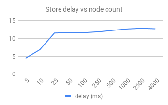
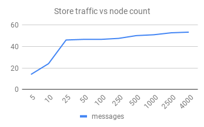
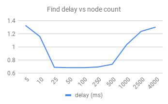
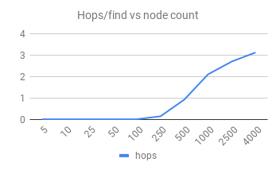
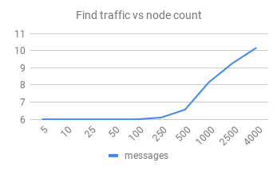
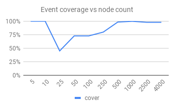
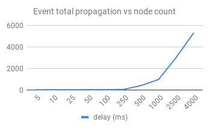
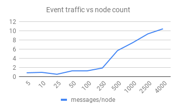

TLDR: Sophia is a DHT (distributed key-value store) based on kademlia. A wasm32
VM is provided and allows contracts to interact with the DHT, when reacting to
pubsub events.

Todo
----

- [x] Kademlia prototype
- [x] Publish/subscribe prototype
- [ ] Finish network impl (error codes, kademlia republish/pings, retries on timeout, security..)
- [ ] Clean Node code, much room for code factorisation
- [ ] More network unit tests
- [ ] VM & API (based on https://github.com/Jiboo/wembed)
- [ ] DApps samples
    - [ ] Torrent like swarm, based on topic pubsub of bitfields and rpc for data

Rationale
---------

I decided that instead of rolling yet another protocol based on some consensus
algorithm that won't be state-of-the-art within some years, a "wiser" move
might be to provide a framework that allows researchers to test consensus
algorithms on a framework providing the basic building blocks needed.

Crypto
------

This document will refer to several high-level API provided by the 1.0.14
version of [libsodium](http://github.com/jedisct1/libsodium), for reference:

[crypto_box_*](https://download.libsodium.org/doc/public-key_cryptography/authenticated_encryption.html):
- Key exchange: X25519
- Encryption: XSalsa20 stream cipher
- Authentication: Poly1305 MAC

[crypto_sign_*](https://download.libsodium.org/doc/public-key_cryptography/public-key_signatures.html):
- Authentication: Ed25519

[crypto_pwhash_*](https://download.libsodium.org/doc/password_hashing/the_argon2i_function.html):
- Key derivation and password hashing: Argon 2 v1.3

[crypto_hash_*](https://download.libsodium.org/doc/password_hashing/the_argon2i_function.html):
- Hashing: BLAKE2b

Exchanges
---------

References:
- [Kademlia's paper](https://pdos.csail.mit.edu/~petar/papers/maymounkov-kademlia-lncs.pdf)
- [XLattice's specs](http://xlattice.sourceforge.net/components/protocol/kademlia/specs.html)

A DHT allows cooperating nodes to maintain a distributed key-value database.

Clients will contact a lot of nodes for not much exchanges during a Kademlia
searches, UDP is preferred. I won't go down the path of implementing my own
transport on top of UDP, so value size is limited by minimal MTU.

IPv4 minimal MTU is too small to have relevant value size, so we're going full
IPv6 support requirement from node to node, and assume a maximum MTU of 1280.

    msg_crypto_header (72B):
        u256 msg_src
        u192 msg_nonce
        u128 msg_signature

All exchanges between nodes are encrypted using `crypto_box`, the node-ids are
cryptographic public-keys, avoiding the need to exchange keys between nodes
before being able to send messages.
`msg_crypto_header` is the only unencrypted portion of messages.

    msg_header (4B):
        u8 msg_type
        u24 cmd_token

`cmd_token` is randomly generated by the source of commands, and is used to
distinguish replies when sending multiple commands to the same node.

Maximum message size is:

    + 1280 (IPv6 MTU)
    -   40 (IPv6 header)
    -    8 (UDP header)
    -   72 (msg_crypto_header)
    -    4 (msg_header)
    = 1156

With "values" of 1024B maximum, this leaves 132B for metadata.

Each nodes uses two sets of keypairs:
- "event-keypair": a keypair generated through `crypto_sign`,
- "msg-keypair": derived from the event-keypair using
  `crypto_sign_ed25519_*_to_curve25519` that will be used for `crypto_box`.

Values
------

    value:
        u256 id
        u256 parent
        u512 value_signature
        u8 value_type
            0x00 unspecified/blob
            0x01 contract
            0x02 library
            0x03 topic_bootstrap
        u24 value_revision          (total value_header is 132 bytes)
        value_data (up to 1024B)

Values are mutable and not encrypted, they are signed using `crypto_sign`
(although contracts may use the cryptographic API to encrypt them). Each value
has a `crypto_sign` keypair, the public-key is its ID, and the private-key is
required to push new revisions (with a valid signature). The signature is
on a concatenation of all fields except `value_signature`.

To create immutable signed values, just make `value_revision = 0xFFFFFF`.

    value_type 0x00: unspecified/blob
        blob (up to 1024B)

Thus values are created by contracts.

    value_type 0x01: contract
        bytecode (up to 1024B)
    value_type 0x02: library
        bytecode (up to 1024B)

`library` are special bytecode module that may be imported by `contract`.

    value_type 0x03: topic_bootstrap
        no data

`topic_bootstrap` are special values used to "claim" a value ID for a topic.
Nodes hosting thus values are considered topic "hosts", they must maintain a
list of nodes subscribed to the topic, so that nodes wanting to join gets a list
to bootstrap onto.

Sophia isn't intended to store values >1KiB, although, some "swarming" protocol
may be implemented through contracts on top of the publish/subscribe mechanism.

Routing
-------

As defined per Kademlia, nodes maintain a list of "close" nodes, the distance
being determined by a XOR of two keys (either between nodes or a node and
value). Known nodes are assigned in 256 buckets, one for each bit of keys.

The bucket-index corresponds to the first "set" bit of the distance (
`ffs`/`clz`, FindFirstSet/CountLeadingZeros). So the first bit already divide
the key-space in two, half of keys will be in bucket-0 (where the first bit of
the keys don't match), the rest of the key space will fall into
`bucket-index = ffs(xor(curNode, otherNode))`.

This way, the node maintain a "vague" list of distant nodes, but have more and
more precise knowledge of nodes close to it in the key space. So when we do a
request, we iteratively get closer to the key, until we reach the nodes that
are the closest to the key on the network in `O(log(n))` (where n is number
of nodes on the network).

Note: this is an introduction/suggestion, the actual algorithm for routing is
up to implementation, and might be something like the BitTorrent "splitting
buckets" mechanism.

Buckets size is limited to `k`, when appending a node to a full bucket, the
node should prioritize distant nodes by a score mainly defined by a small
roundtrip-time and availability (uptime%) of the distant node.

Low level operations
--------------------

Upon receiving a command, the recipient should update their table with the
source id&ip&port. The same goes for the initiator node when receiving the
reply. Either to improve it's table when buckets are not full, or to update the
"score" of nodes with the roundtrip-time.

    msg_type 0x10: ping
        1156 bytes of random data
    msg_type 0x20: pong
        1156 bytes that were in the ping

ping/pong are used to assert that a node is still available, reachable, and has
the required MTU.

    msg_type 0x11: closest_nodes
        payload: u256 id
    msg_type 0x12: find_value
        payload: u256 id

    msg_type 0x21: nodes_result
        payload:
            u8 count (max 20)
            list of ‘count’ elements of:
                u256 node-id
                u128 ipv6
                u16 port
    msg_type 0x22: value_result
        payload: value

The recipient of a `closest_nodes` request should look into it's routing table
to find the closest peer to the requested `id` and return them in a
`nodes_result` reply. The returned element must be ordered from closest to
farthest from the requested `id`.

The recipient of a `find_value` request should look into it's value local
store to search for the specified `id`, if it does have the value it should
return it with a `value_result` reply, otherwise it should behave as if the
request was a `closest_nodes` and return a `nodes_result` reply.

    msg_type 0x13: store
        payload:
	        value

Asks the recipient node to cache the value in its local store for a specific
time before expiration. To maintain the availability of values, nodes should
send them again periodically.

The store command is also used to update mutable values, the recipient should
accept the update only if `value_revision` is greater than the revision in its
local store and if the `value_signature` is valid.

    msg_type 0x00: result
        payload:
            u32 code
                0x0: no error
                0x1: unspecified error
                0x2: illformed
                
                // Errors for `ping`
                0x1000: MTU too low

                // Errors for `store`
                0x1300: local store full
                0x1301: key already assigned
                0x1302: value crypto mismatch
                0x1303: not latest revision

                // Errors for `pubsub_ping`
                0x3000: not registered
                
                // Return codes for `rpc`
                0x4000: contract not subscribed
                0x4001: contract internal error
                0x4080-40ff: custom, reserved for contracts
            

As any reply, the `result` message will have a `token` matching the one in the
command that generated the result.

Iterative algorithm
-------------------

The `get` and `put` high-level operations, are iterative operations that uses
low level operations to search the network for a node that will have the value
or should store it.
 
The node will then send a round of `find_value`/`closest_node` (respectively for
a `get` or `put` operation) in parallel to `alpha` nodes.

The client continues to send other rounds of low level commands until no nodes
received is closer than any other in the `nodes_list`. If it's relevant, some
nodes might be added to buckets at each round.

If the operation was a `find_value`, and one of the iterative lookup returned
a `value_result` the search is abandoned.

If the operation was for a `put`, the initiator replicates the value on `k`
closest nodes.

Publish/Subscribe
-----------------

References:
- BitTorrent's [BEP_0050](http://www.bittorrent.org/beps/bep_0050.html)
- [Pseudo Reliable Broadcast in the Kademlia P2P System](https://pdfs.semanticscholar.org/ca86/1c4b018e17402eca4a00e0f42e110d1743dd.pdf)
- [Enhancing the Kademlia P2P Network](https://pp.bme.hu/ee/article/download/823/442/)

The publish-subscribe mechanism is used to dispatch events toward a subset of
nodes, that are subscribed to a topic. Events are considered unreliable, and
may take multiple seconds to reach all subscribed nodes.

There is no private topics, and events aren't encrypted, although contracts may
use available cryptographic API to encrypt events' data somehow, if they can
solve other problems like key-exchange.

Topics are organized just as the main kadmelia overlay, they are just
sub-overlays. To create a topic, a `store` is performed of a special empty
value `topic_bootstrap` with no data. Nodes having this value are considered
"hosts" and must maintain a small list of nodes currently subscribed so that
nodes wanting to subscribe may bootstrap.

    msg_type 0x30: pubsub_join
        payload:
            u256 topic_id

Upon receiving a `pubsub_join`, hosts reply with a `pubsub_nodes_result` of
nodes currently in the topic specific routing-table closer to the node-id of
the new subscriber.
`pubsub_join` may also be used by hosts to subscribers, as a way to ping them.

Hosts receiving an unknown `topic_bootstrap` value to store, should initialize
their routing table for that topic, and add the sender as the first node in the
associated bootstrap list.

    msg_type 0x31: pubsub_closest_nodes
        payload:
            u256 topic_id
            u256 node_id
    msg_type 0x38: pubsub_nodes_result
        payload:
            u8 count (max 20)
            list of ‘count’ elements of:
                u256 node-id
                u128 ipv6
                u16 port

`pubsub_closest_nodes` behaves like `closest_nodes` it just have an extra
`topic_id` to target a specific routing table.

    msg_type 0x32: pubsub_event
        payload:
            u256 topic_id
            u256 source_id
            u512 event_signature
            u8 height
            u8 event_type
            u16 event_extra     (total event_header is 132 bytes)
            event_data (up to 1024B)

`event_type` and `event_extra` may be used by contracts to store extra info, 
that will be passed as parameters to topics-listening callbacks but have no
incidence in the routing.

`height` is used by the dispatching algorithm to spread events deeper and deeper
in the tree, as described by the multicast algorithm. Upon receiving a
`pubsub_event`, a node will iterate over it's topic specific routing-table
buckets from `height` to 256, will select `event_replication` random nodes from
each buckets and forward them the event with an `height` incremented.

Events can't be anonymous, nodes seeing an `height` of 0 would know that
`msg_src` created it. So, as it may be useful to some contracts, we add the
source and a signature so that other nodes may verify that the event wasn't
tempered with. Fields `event_signature` and `height` shouldn't be used to
compute the signature of the event.

Impl notes (TODO: Maybe put in a GitHub issue): I'm using a `event_replication`
although I'm not satisfied with the reliability. Although implementing
something more reliable might be possible through RPC in a library contract.
So I won't increase the replication, that has a huge impact on traffic.

I take a different codepath if the publisher has less than 20 nodes in its
table, he forwards it to all known nodes. This fixes reliability issues for
topic with 20 or less users, altough the [20-100] range is painfully
unreliable, above 100 we're at 80% reach.

RPC
---

The RPC command is used for direct reliable communication between nodes.

    msg_type 0x40: rpc
        payload:
            u256 contract_id
            u32 rpc_param32
            u256 rpc_param256
            u512 rpc_param512
            rpc_data (up to 1024B) (total rpc_header is 132 bytes)

An RPC command is sent by a contract, to another node and contract specified by
`contract_id`. All `rpc_` fields values are up to the contracts.

No need for signature of data because the emitter always is the source, and
msg_header is used for integrity and identification checks.

Security
--------

References:
- [S/Kademlia: A Practicable Approach Towards Secure Key‐Based Routing](https://pdfs.semanticscholar.org/3165/2823ca71520038773346b6e5bbfadc5c8419.pdf)
- [A Survey of DHT Security Techniques](http://disi.unitn.it/~montreso/ds/papers/DhtSecuritySurvey.pdf)

Sophia allows trusted contracts to add nodes to a blacklist, so some new
mitigation techniques may be added later.

- Underlay network

Spoofing, Eavesdropping, Packet modifications... Sophia mitigates this with
end-to-end encryption, with the node-id being a cryptographic public-key.

- Eclipse

The eclipse attack consists of creating node-ids close to a specific other ID
to either isolate a node, or don't return a value. Sophia mitigates this
because node-id aren't arbitrary and require to generate a crypto keypair close
to the target, which may require some computation (if we have an important
number of other honest nodes).

- Sybil

The Sybil attack consists of creating a huge number of nodes to disrupt the
system. Sophia doesn't currently implement any counter-measures for it.

- Storage

The storage attack consist of replying incorrect/modified values. Sophia
avoids this by signing values. As each value has its own keypair, generating
a valid signature for a specific value would require its private key.

- Routing

Crazy shit I don't fully understand. Sophia probably doesn't provide any
counter-measures.

- Amplification

Flood nodes with a spoofed IP address so that the replies are sent to a DDoS
target. Sophia mitigates this by refusing nodes with a port < 1024.

Contracts
---------

### Bytecode

Sohpia clients are required to be able to validate and execute wasm32
binary format 1.0.

Note: the specification is still a [working draft](https://www.w3.org/TR/wasm-core-1/).

### VM environment

TODO define imports provided by sophia clients to wasm modules, allowing them
to:
- blacklist an ID
- get and put to DHT
- join, leave, listen and push events to pubsub topics
- rpc on other nodes (for unicast)
- sodium crypto
- zlib compression

Performances
------------

Thus charts where generated using stats dumped by tst/network.cpp
([details](https://docs.google.com/spreadsheets/d/189yyDMZGnVGXWnAGIDQU8gQEYjUCgjoe7d_x6gyTRhw/edit?usp=sharing)).

